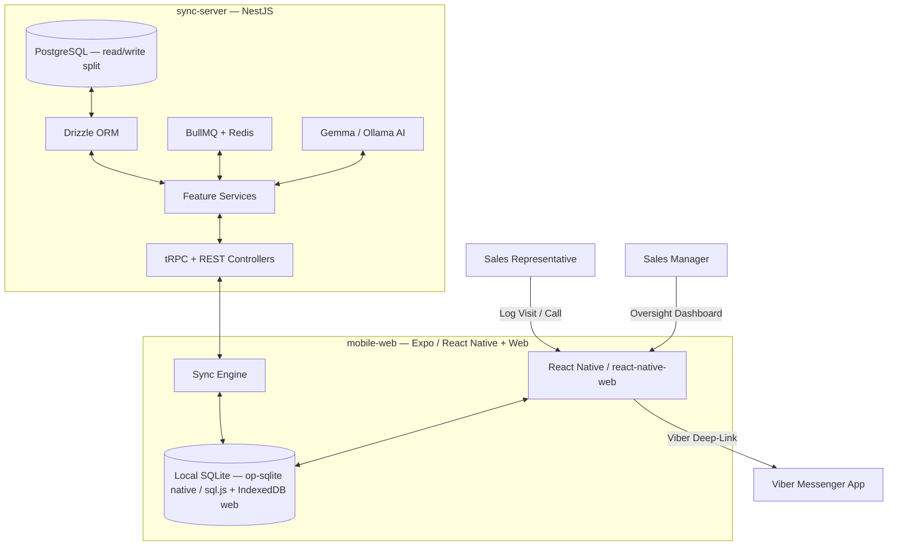

# System Architecture Documentation

This document describes the high-level system architecture, database design, and synchronization protocols of the **Burma Sales & Inventory Manager**.

---

## 1. System Overview

The system is an **Offline-First Multi-Platform Monorepo** managed with **Nx**. It enables sales representatives in the field to record customer interactions, order volumes, and market intelligence without an active internet connection, syncing to a central PostgreSQL database when connectivity returns.



---

## 2. Monorepo Organization

The workspace is split into four Nx projects:

- [**mobile-web/**](./mobile-web): Expo (React Native) app targeting native devices and the web (via `react-native-web`). Owns the local SQLite database, the sync engine, and all field/admin screens. UI is feature-sliced under `src/features/*` with shared infrastructure under `src/core/*`.
- [**sync-server/**](./sync-server): NestJS backend (Express/Fastify platform adapters) exposing a tRPC router and REST controllers. Orchestrates sync push/pull, AI processing, and background jobs. Layered as `core/*` (infrastructure) and `features/*` (domain).
- [**ui-components/**](./ui-components): Shared design system built on `@shopify/restyle` — themed primitives (`Box`, `Text`), `Button`, `Card`, `Table`, `TextField`, `DropdownSelector`, `Skeleton`, a centralized `shadows` helper, and the light/dark `theme`.
- [**shared-types/**](./shared-types): Single source of truth for the database schemas (Drizzle), domain/record TypeScript types, zod validation, the tRPC `AppRouter` type, and the `guardAsync` error-isolation primitive.

---

## 3. Technology Stack

| Concern               | Technology                                                                               |
| :-------------------- | :--------------------------------------------------------------------------------------- |
| Backend framework     | **NestJS 11** (`@nestjs/platform-express` / `-fastify`)                                  |
| Type-safe transport   | **tRPC 11** (typed `AppRouter`) + REST controllers for multipart uploads                 |
| ORM / query builder   | **Drizzle ORM** — `pg-core` (server) and `sqlite-core` (client), one schema per platform |
| Server database       | **PostgreSQL** with a read/write connection split                                        |
| Native client DB      | **op-sqlite** (synchronous JSI SQLite)                                                   |
| Web client DB         | **sql.js** (WASM SQLite) persisted to **IndexedDB**                                      |
| Background jobs / DLQ | **BullMQ** over **Redis** (`ioredis`)                                                    |
| AI                    | **Gemma** via an **Ollama**-compatible HTTP endpoint                                     |
| Client state          | **Zustand** stores + feature hooks                                                       |
| Design system         | **`@shopify/restyle`** theme tokens (Tailwind is prohibited)                             |
| Validation            | **zod** schemas at every transport boundary                                              |

---

## 4. shared-types: the schema & type source of truth

`shared-types/src/lib` is organized by concern:

- `db/schema.ts` — PostgreSQL Drizzle tables (server).
- `db/schema-sqlite.ts` — SQLite Drizzle tables (client).
- `db/schema-relations.ts` — Drizzle relational metadata, kept separate so the table layer stays a pure structural definition.
- `db/schema-parity.spec.ts` — an **automated parity guard**: it introspects both schemas and fails if the client and server schemas drift outside the documented, intentional exceptions (see §6).
- `types/records.ts` — snake_case on-disk / on-the-wire record interfaces.
- `types/domain.ts` — camelCase app-facing interfaces.
- `types/sync.ts` — sync protocol transport types (`WatermelonChangeSet`, `SyncTableName`, pull/push payloads).
- `types/shared-types.ts` — domain constants + the zod validation layer; re-exports the above as a barrel so the public import path is stable.
- `utils/guard.ts` — `guardAsync`, the standard error-isolation tuple primitive.
- `api/trpc.ts` — the tRPC `appRouter` schema and exported `AppRouter` type.

---

## 5. sync-server: layered architecture

The server follows a **Controller/Router → Service → (collaborators) → Drizzle** layering:

- **`core/`** — infrastructure: Drizzle connection service, database seeding (`core/seed/*`), config (`AppConfig`), auth (actor interceptor/service), the tRPC router/controller, BullMQ queue + worker, and the zod validation pipe.
- **`features/`** — domain modules:
  - `sync/` — `SyncService` orchestrates pull/push, delegating to focused collaborators: `ConflictResolutionService` (field-level last-write-wins), `AnomalyDetectionService` (config-driven thresholds), and audit hash-chain helpers (`audit/audit-hash.ts`). The `sync-registry` centralizes per-table snake↔camel marshalling.
  - `ai/` — a slim `AiService` facade delegating to `ModelDispatcherService` (the single LLM call site, with bounded retry/backoff), `SentimentAnalyzerService`, `EodCompilerService`, `PaymentOcrService`, and `ScreenshotVerifierService`.
  - `health/` — liveness.

Business thresholds (anomaly multiplier/window, batch-dump window, auto-invoice due/grace days, LLM retry/backoff) live in `AppConfig`, not inline literals.

---

## 6. Database Schema Parity

The PostgreSQL and SQLite schemas are kept aligned for all **shared** tables. Two divergences are **intentional and enforced** by `schema-parity.spec.ts`:

1. **Platform-only tables.** Server-only: `users`, `sync_audit_logs`, `idempotency_keys`. Client-only offline queues: `image_upload_queue`, `draft_carts`.
2. **Server-only columns on shared tables.** The server keeps `deleted_at` (soft-delete; the client applies deletes by removing rows) and, on `interaction_logs`, `ai_verification_status` / `ai_verification_notes` (server-side AI audit metadata). No other per-column divergence is permitted.

> Note: the client's SQLite tables are additionally created from explicit DDL in `mobile-web/src/core/database/database.{web,native}.ts`. Keep that DDL, the Drizzle `schema-sqlite.ts`, and the parity allowlist in sync when adding columns.

---

## 7. Offline-First Synchronization Protocol

Synchronization between the client SQLite database and the server PostgreSQL database is a two-stage pull/push operation.

```
Client (SQLite)                               Sync Server (PostgreSQL)
        |                                                 |
        | ------ 1. sync.pull(lastPulledAt) ------------> |
        |                                                 | [Filter changed since lastPulledAt]
        | <----- 2. Changes + server timestamp ---------- |
        |                                                 |
[Apply changes locally]                                   |
        |                                                 |
        | ------ 3. sync.push(local change queue) ------> |
        |                                                 | [Single transaction]
        |                                                 | [Field-level last-write-wins]
        | <----- 4. Acknowledgement --------------------- |
```

### Pull

- The client requests records changed since its local `last_pulled_at`.
- The server returns a delta of `created` / `updated` / `deleted` per table.
- The client applies changes to local SQLite.

### Push

- The client sends accumulated local `created` / `updated` / `deleted` records.
- The server processes them in a single transaction. On conflict, `ConflictResolutionService` resolves per field using last-write-wins against the client's last-pull timestamp.
- Primary records are written before their join rows to preserve referential integrity.
- After a successful push, `AnomalyDetectionService` flags outlier order quantities and pushed logs may trigger screenshot-verification jobs.

### Transports

- **tRPC** (`sync.pull` / `sync.push`) is the typed primary transport.
- **REST** (`SyncController`) handles multipart **file uploads** (Viber screenshots, proof-of-delivery, competitor photos) and delegates sync to the same `SyncService`.

### Resilience

- Failed network requests keep local writes queued; the sync engine retries when connectivity returns.
- Server-side insertion failures are isolated and logged without crash-looping the process.
- Requests carry `x-trace-id` and `x-hash-chain` headers; malformed frames are routed to a BullMQ dead-letter queue.

---

## 8. Viber Integration & Image Handling

Viber is the primary field communication channel in Myanmar.

- **Deep-Linking** via `viber://chat?number=<phone>` from shop contacts.
- **Proof screenshots** are attached to interactions and uploaded via the REST upload endpoint, then verified asynchronously by `ScreenshotVerifierService`.
- Screenshots are compressed client-side for slow networks before upload.

---

## 9. AI-Enabled Oversight (Gemma)

A Gemma model (Ollama-compatible endpoint) on the server:

- Parses free-text/voice interaction notes into structured records.
- Runs sentiment classification over visit comments (`SentimentAnalyzerService`).
- Compiles end-of-day field-report digests (`EodCompilerService`).
- Performs OCR on invoices and payment transfers and reconciles payments FIFO (`PaymentOcrService`).

All model calls funnel through `ModelDispatcherService`, the single integration point, with a bounded retry/backoff and graceful null-on-failure semantics so heuristics can fall back when the model is unavailable.

---

## 10. Advanced Offline Capabilities

- **Offline map tile pre-caching** — OpenStreetMap tiles are captured into a local store for interactive maps without connectivity.
- **Multi-currency pricing & price books** — region-specific price books with on-device currency conversion (MMK/USD/THB) for offline invoicing.
