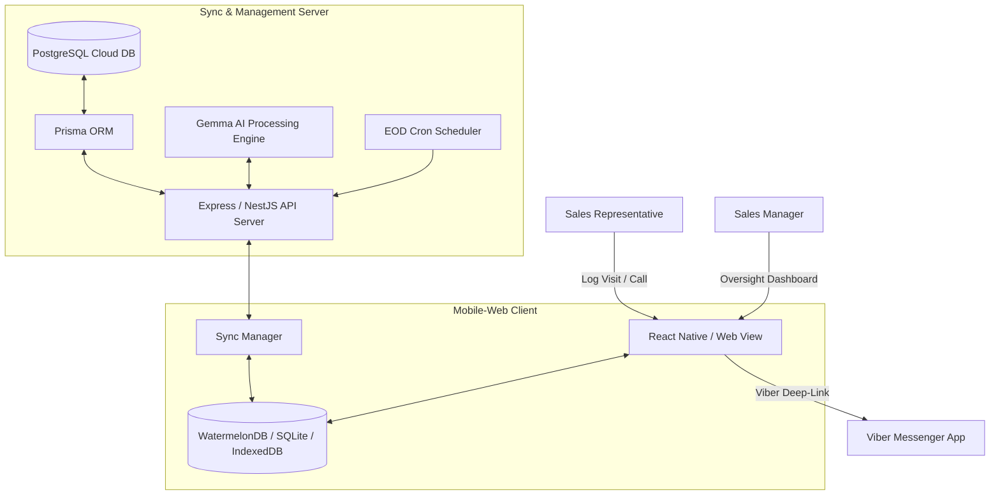

# System Architecture Documentation

This document describes the high-level system architecture, database design, and synchronization protocols of the Burma Inventory application.

---

## 1. System Overview

The system is designed as an **Offline-First Multi-Platform Monorepo** managed with **Nx**. It enables sales representatives in the field to record customer interactions, order volumes, and market intelligence without an active internet connection, automatically syncing to a central PostgreSQL database when online.



---

## 2. Monorepo Organization

The workspace is split into projects under the Nx ecosystem:

- [**mobile-web/**](file:///Users/justin.zhang/Desktop/burma/burma-inventory/mobile-web): React Native/Expo application targeting both web viewports (desktop) and native platforms. Manages localized database storage and synchronization triggers.
- [**sync-server/**](file:///Users/justin.zhang/Desktop/burma/burma-inventory/sync-server): Express backend connecting to PostgreSQL. Orchestrates database sync payloads, runs background EOD cron audits, and drives AI text parsing/summarization.
- [**ui-components/**](file:///Users/justin.zhang/Desktop/burma/burma-inventory/ui-components): Shared presentation system built on top of `@shopify/restyle`. Houses core buttons, text fields, boxes, and themes.
- [**shared-types/**](file:///Users/justin.zhang/Desktop/burma/burma-inventory/shared-types): Common TypeScript interfaces, model definitions, and database schemas shared between the frontend client and the sync server.

---

## 3. Database Schema Mapping

The database schema aligns PostgreSQL (backend) and WatermelonDB/SQLite (client).

| Entity              | WatermelonDB Table (Client) | Prisma Model (Backend) | Purpose                                              |
| :------------------ | :-------------------------- | :--------------------- | :--------------------------------------------------- |
| **User**            | (Auth Context)              | `User`                 | Authenticated representatives & managers             |
| **Region**          | `regions`                   | `Region`               | Geographic sales territories (e.g. Yangon, Mandalay) |
| **Shop**            | `shops`                     | `Shop`                 | Stores visited by sales reps (LTV & Sentiment)       |
| **Contact**         | `contacts`                  | `Contact`              | Shop owners, primary contact numbers                 |
| **Item**            | `items`                     | `Item`                 | Centralized SKU master catalog                       |
| **InteractionLog**  | `interaction_logs`          | `InteractionLog`       | Sales visit/Viber/Phone reports with notes           |
| **InteractionItem** | `interaction_items`         | `InteractionItem`      | SKUs associated with a specific interaction          |
| **DailyQuota**      | `daily_quotas`              | `DailyQuota`           | Quota targets assigned to reps                       |

---

## 4. Offline-First Synchronization Protocol

The synchronization between the client database (WatermelonDB) and the sync server (PostgreSQL) is managed in a two-stage pull/push operation:

```
Client (WatermelonDB)                         Sync Server (PostgreSQL)
        |                                                 |
        | ------ 1. GET /sync (last_pulled_at) ---------> |
        |                                                 | [Filter by Region]
        | <----- 2. Pull changes + Server Timestamp ----- |
        |                                                 |
[Apply Local Changes]                                     |
        |                                                 |
        | ------ 3. POST /sync (local push queue) ------> |
        |                                                 | [Transaction Block]
        |                                                 | [Last-Write-Wins Conflict Resolve]
        | <----- 4. Sync Acknowledgement ---------------- |
```

### Pull Details

- Client requests updates since the local `last_pulled_at` timestamp.
- Server returns a delta changeset representing `created`, `updated`, and `deleted` entries for the user's active region.
- Client resolves conflicts and updates local SQLite storage.

### Push Details

- Client compiles a list of local modifications (`created`, `updated`, `deleted` entries).
- The server processes changes inside a single database transaction (`$transaction`) to maintain referential integrity.
- If a record conflict occurs, the record with the most recent `updatedAt` wins.

---

## 5. Viber Integration & Image Handling

Viber is the primary communication tool for sales in Myanmar.

- **Deep-Linking**: Shop contacts feature a Viber icon button that triggers deep-linking via the Viber URI schema:
  `viber://chat?number=<Phone_Number>`
- **Proof-of-Work Screenshots**: Reps attach screenshot files of Viber chats.
- **Client-Side Compression**: To adapt to slow networks, screenshots are compressed on the device to a maximum of `200KB` before storage or upload.

---

## 6. AI-Enabled Oversight (Gemma)

The application incorporates a local **Gemma AI** model integrated on the sync server to:

- Parse unstructured speech-to-text or free-text interaction notes into structured sales records.
- Run sentiment classification (Positive, Neutral, Negative) over visit comments.
- Summarize daily field reports at 8:00 PM to compile an EOD management digest email.
